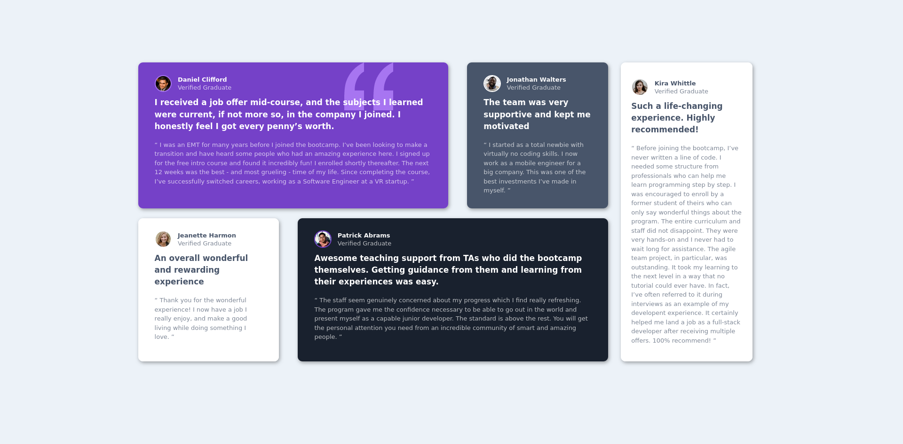
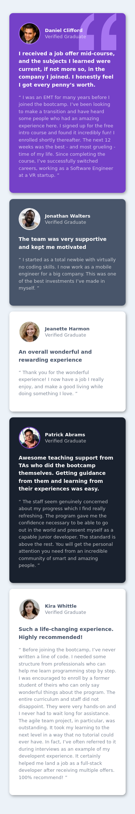

# Frontend Mentor - Testimonials grid section solution

This is a solution to the [Testimonials grid section challenge on Frontend Mentor](https://www.frontendmentor.io/challenges/testimonials-grid-section-Nnw6J7Un7). Frontend Mentor challenges help you improve your coding skills by building realistic projects. 

## Table of contents

- [Overview](#overview)
  - [The challenge](#the-challenge)
  - [Screenshot](#screenshot)
  - [Links](#links)
- [My process](#my-process)
  - [Built with](#built-with)
  - [What I learned](#what-i-learned)
  - [Continued development](#continued-development)
  - [Useful resources](#useful-resources)
- [Author](#author)
- [Acknowledgments](#acknowledgments)

## Overview

### The challenge

Users should be able to:

- View the optimal layout for the site depending on their device's screen size

### Screenshots

[Screenshots folder](./screenshots)
#### Desktop

#### Mobile


### Links

- Solution URL: [Add solution URL here](https://your-solution-url.com)
- Live Site URL: [Add live site URL here](https://your-live-site-url.com)

## My process

### Built with

- Semantic HTML5 markup
- CSS custom properties
- Flexbox
- CSS Grid
- Mobile-first workflow

### What I learned

I learned how to use different attributes of flexbox for formatting diferent elements.

Another thing that I have learned is how to chain classes and ID's for different elements, here are some examples:

```css
.testimonial-header img {
    border-radius: 50%;
}

.header-text {
    margin-left: 1rem;
}

.header-text .graduate-name {
    opacity: 100%;
    font-weight: 600;
    margin-bottom: 0;
}

.header-text .verified-text {
    opacity: 70%;
    margin-top: 0;
}

.main-testimony {
    font-size: 1.1rem;
    font-weight: 600;
}

.sub-testimony {
    opacity: 70%;
}

.main-testimony,
.sub-testimony {
    line-height: 150%;
}
```

### Continued development

After this project I will try to recreate the way its formatted for testimonial pages that I plan on doing in the future.

### Useful resources

- [The tutorial that greatly helped me finish the project](https://youtu.be/zJSY8tbf_ys) - This helped me build my foundations for coding in HTML and CSS

## Author

- Frontend Mentor - [@ReinX24](https://www.frontendmentor.io/profile/ReinX24)

## Acknowledgments

I would like to thank Zach Gollwitzer and the freeCodeCamp Youtube channel, without them I would have never finished this project.